# Architecture

## 1. System overview

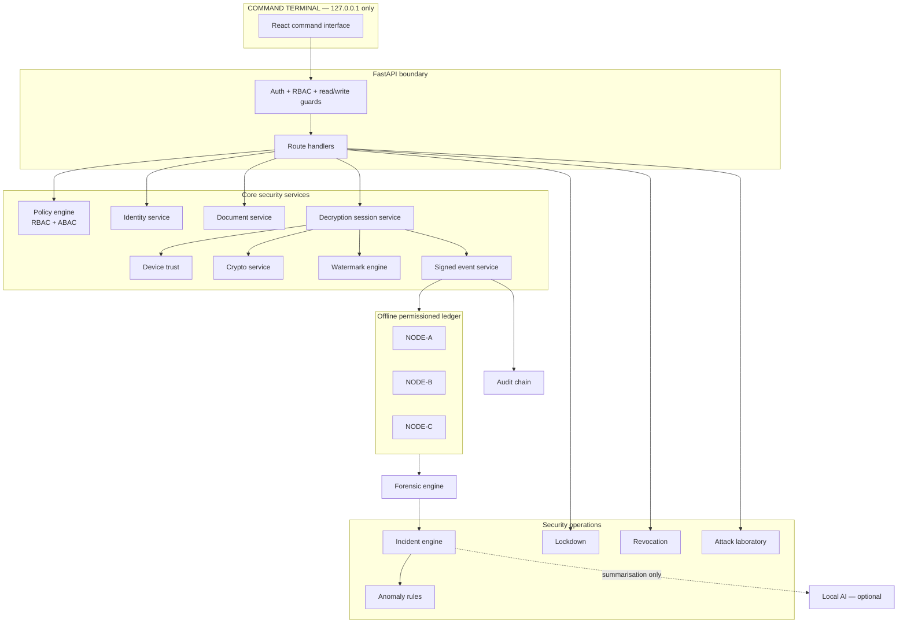

Trust boundaries, stated plainly:

1. **Browser ↔ backend** — loopback only; the runtime egress guard refuses anything else.
2. **Backend ↔ ledger nodes** — separate processes would be separate hosts in production; here each
   node owns a separate database file so a single-file compromise is not a whole-ledger compromise.
3. **Backend ↔ local AI** — one-way. The model reads verified summaries and returns advisory text. It
   cannot influence any decision.
4. **Key vault** — separate storage from the operational database, so reading the database does not
   reveal key material.

---

## 2. Identity and authentication flow

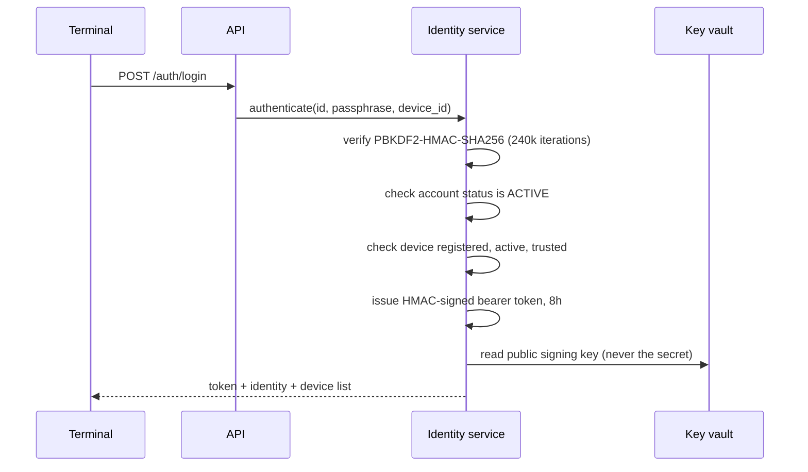

Every subsequent request re-reads the account from the database. A token that is still valid cannot
outlive a revocation, because authorisation never trusts the token's cached claims.

---

## 3. Authorisation: fourteen checks, deterministic

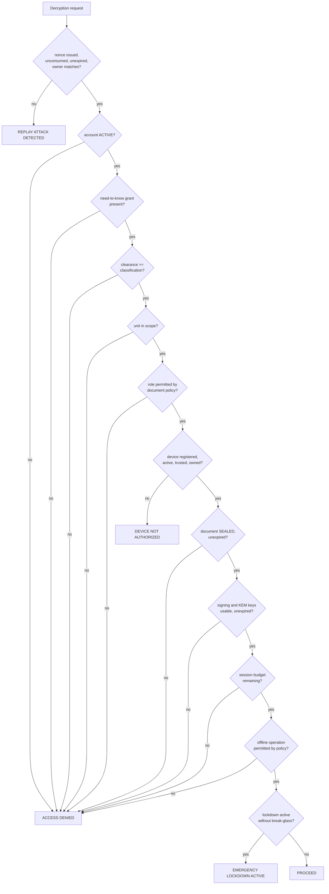

Each check returns a reason code such as `NEED_TO_KNOW_MISSING` or `CLEARANCE_BELOW_SECRET`. The full
trace is stored on the session and shown in the UI, so a refusal is always explainable.

---

## 4. Document lifecycle

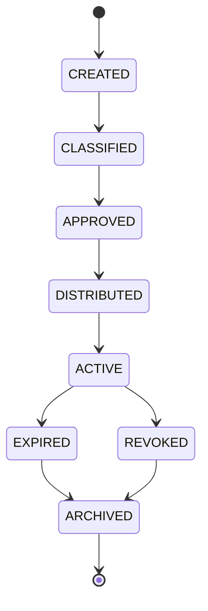

Lifecycle state is separate from access availability (`SEALED`, `SUSPENDED`, `REVOKED`) because a
document can be `ARCHIVED` yet still have been `ACTIVE` when it leaked, and the forensic record must
show which.

Every transition writes an audit record. Illegal transitions raise rather than silently succeed.

---

## 5. Encryption and key wrapping

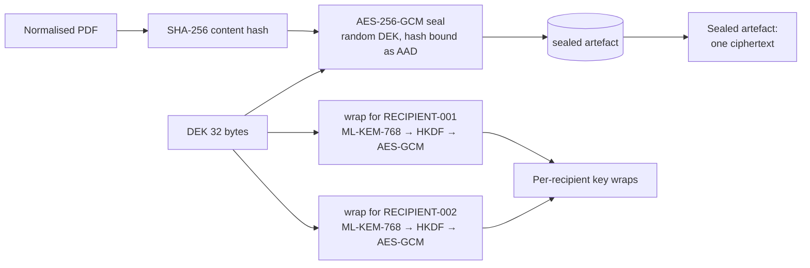

This is the broadcast model from the problem statement: **encrypt once, many recipients**. The
post-quantum KEM is what makes a recipient's copy of the content key something only that recipient can
unwrap.

The document id, version id and content hash are bound in as AEAD associated data, so a ciphertext
moved to a different document or a different declared hash fails to decrypt rather than decrypting to
something that is then checked.

---

## 6. Watermark generation and embedding

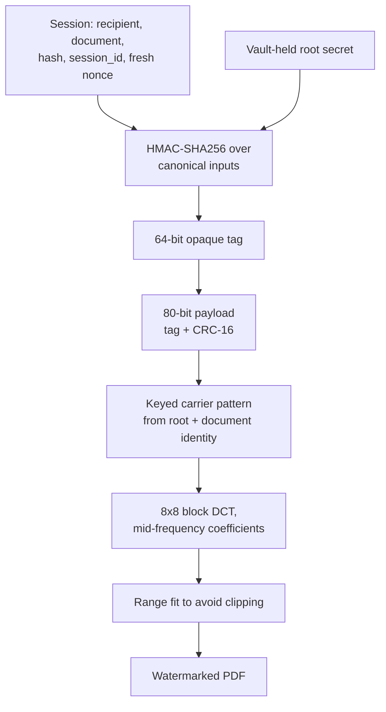

Key properties:

- **Opaque.** The tag is an HMAC output. It contains no readable identity and requires an authorised
  registry lookup to interpret.
- **Session-specific.** A fresh nonce and the session id are inside the derivation, so the same
  recipient opening the same document twice gets two different tags.
- **Carriers keyed to document identity, not to the file.** That is what makes extraction blind and
  survives edits to the leaked copy.
- **Bit value rides on the correlation sign**, so a zero bit is an inverted excursion, not a missing
  one.

---

## 7. Extraction and confidence

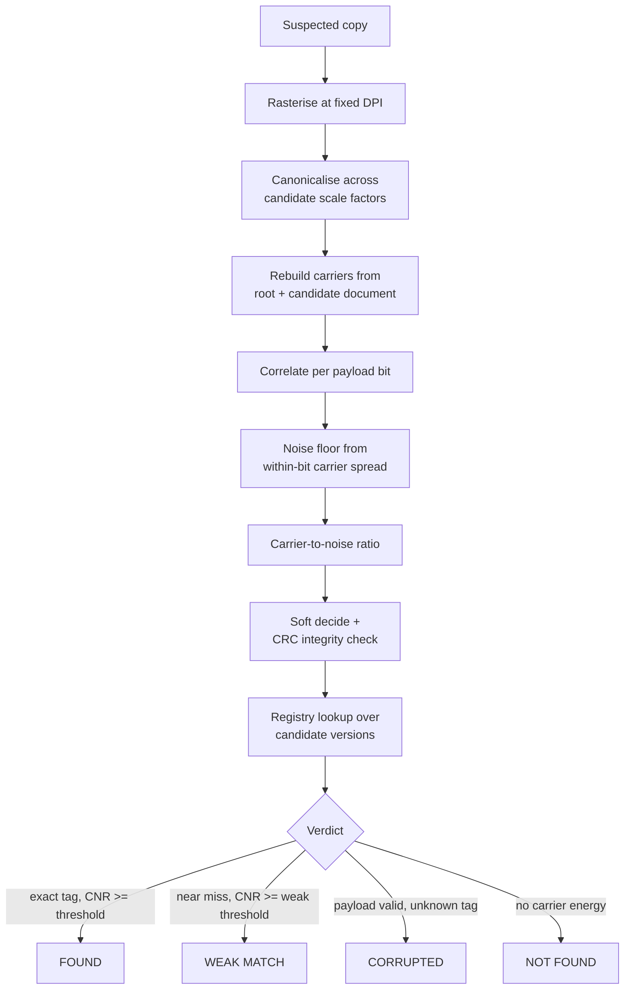

The noise floor is estimated **within** each bit's carrier set. Measuring spread across bits would
mistake the signal itself for noise, which is exactly the mistake that made an earlier version of this
engine report implausible confidence figures.

Confidence is capped below 1.0 by design. A recovered watermark is strong evidence, never certainty.

---

## 8. Signed events

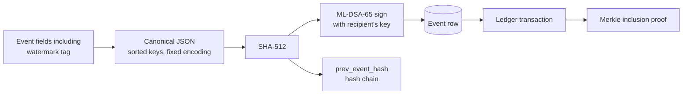

The watermark tag is inside the signed payload. Without it, a recipient could argue the fingerprint
was added after they signed, which would undermine the attribution entirely.

Events are chained by `prev_event_hash`, and the event row is written **after** the ledger accepts
the transaction, so the table needs no update and stays genuinely append-only.

---

## 9. Ledger

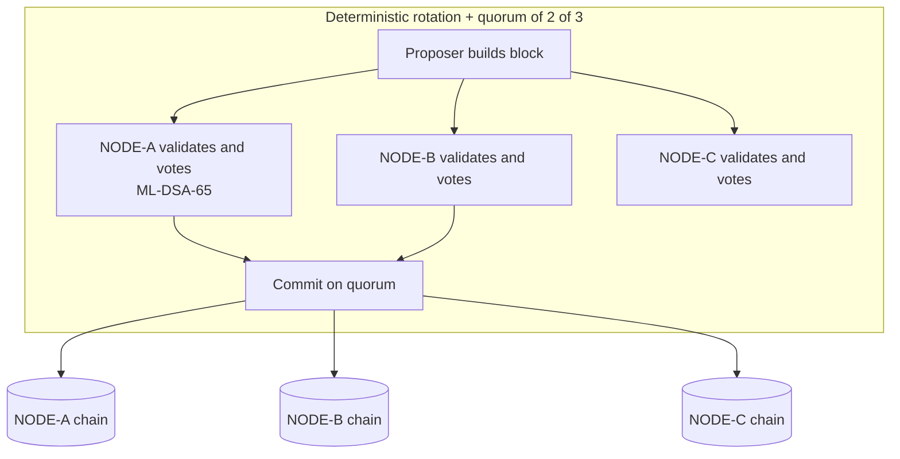

A node independently validates that the proposal extends *its own* chain, so a malicious proposer
cannot fork a node silently.

**Verification** recomputes, per node: chain linkage, Merkle root from stored transactions, block
hash, running state root, block signature and every quorum vote signature. It then compares state
roots across nodes. A node that recomputed only its own block hash still fails, because the Merkle
root and the signatures are recomputed too.

**Below quorum**, events are queued locally rather than dropped. On reconnection they replay through
the same validation path; anything already present is recorded as such, and genuine conflicts are
recorded without overwriting either copy.

---

## 10. Forensic investigation

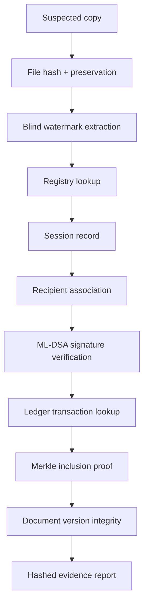

Document integrity uses page-image comparison against the stored pre-encryption render with a
documented PSNR floor. A watermarked but otherwise untouched copy sits near 41 dB; an edited copy
falls below the floor and is reported as `DOCUMENT_MODIFIED`.

The final outcome is one of: `VERIFIED ASSOCIATION`, `PARTIALLY VERIFIED`, `DOCUMENT MODIFIED`,
`WATERMARK NOT RECOVERED`, `NO MATCH FOUND`, `SIGNATURE INVALID`, `LEDGER PROOF INVALID`,
`INSUFFICIENT EVIDENCE`. A partial result is never upgraded.

---

## 11. AI boundary

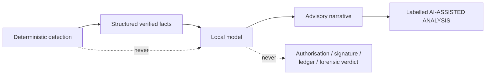

The model receives aggregated, already-verified metadata. It never sees plaintext document content,
and it cannot execute privileged actions. If it is unavailable the platform is unaffected.

---

## 12. Module boundaries

| Package | Owns | Never does |
|---|---|---|
| `core/` | Configuration, policy decisions, crypto primitives, egress guard | Touch the database |
| `crypto/` | PQC provider, key vault, canonical signing, hashing | Decide authorisation |
| `documents/` | Rendering, authenticated encryption, versioning | Emit security events |
| `watermark/` | Derivation, coding, embedding, extraction, verdicts | Know about recipients |
| `ledger/` | Blocks, Merkle proofs, nodes, quorum, verification | Sign on behalf of recipients |
| `forensic/` | Analysis, evidence, reports | Re-embed watermarks |
| `security/` | Incidents, anomalies, lockdown, revocation, attack lab | Bypass the policy engine |
| `services/` | Orchestration and transactions | Implement cryptography |
| `api/` | Transport, validation, guards | Contain business logic |

The watermark engine has no knowledge of recipient identities — it takes a derived tag and a document
reference. That is what makes the same engine usable for embedding and for blind extraction.
