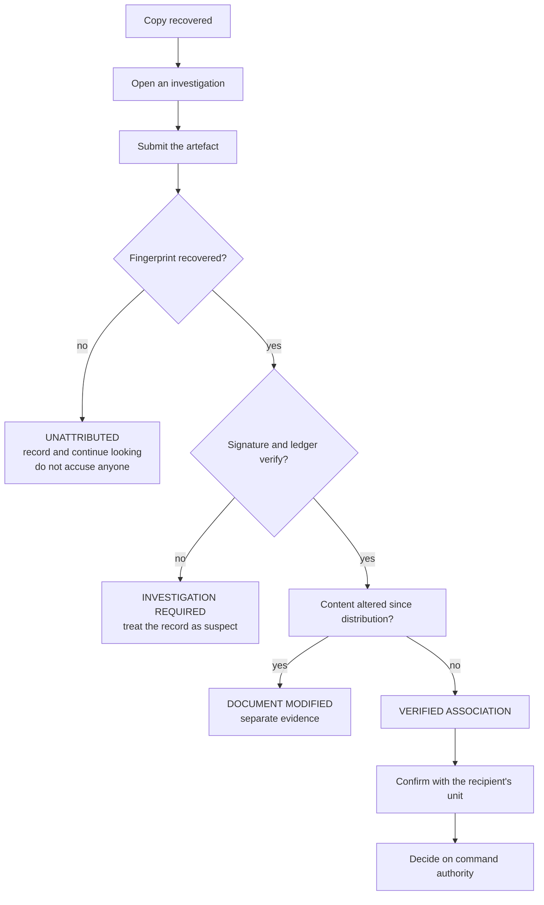

# Commander's guide

No cryptography knowledge needed. This document explains the whole system and, more importantly, what
it can and cannot prove.

---

## 1. What the system does

A sensitive document is encrypted once and sent to several authorised people. Each of them can open it,
and each of them ends up with **exactly the same readable copy**.

If a copy then turns up outside the authorised group, you have a problem: nothing inside the copy says
who opened it, and the logs that would help can be edited by a privileged administrator.

This system fixes that. **Every time somebody opens a document, it leaves behind an invisible
fingerprint that is unique to that single act of opening.** If a copy leaks, the fingerprint says which
opening it came from. The record is signed by the person who opened it, and stored in a ledger that
several independent copies have to agree on — so nobody, including the system's own administrator, can
quietly change it afterwards.

---

## 2. The five questions

**WHO opened it?**
Every decryption is recorded against the person's identity, their registered device, and the exact
document version. Because the person signs the record with a key only they hold, they cannot later deny
having opened the document.

**WHAT document, and WHICH version?**
Documents are versioned. A report can say "VERSION-003" specifically, not just a document name. Each
version keeps its own fingerprint for the whole time.

**WHEN?**
Every decryption is timestamped in UTC.

**WHICH copy?**
Each decryption receives its own unique fingerprint. Two people opening the same document get two
different fingerprints, even though the documents look identical.

**CAN WE PROVE IT?**
Yes — with a stated limit. See section 4.

---

## 3. What happens during an authorised opening

1. The person signs in. The passphrase is checked on this machine only; nothing goes anywhere.
2. They request to open a document. The system issues a **one-time authorisation** tied to them and that
   document.
3. **Fourteen separate checks run**, every one from live current state:
   is the account active, is there a need-to-know grant for this specific document, is their clearance
   high enough, is their unit in scope, does the policy permit their role, is the device registered and
   trusted, is the document current and unexpired, are their keys usable, is the authorisation fresh,
   is there session budget left, is offline operation permitted, and is a lockdown in force.
4. Only if all fourteen pass does any readable content exist.
5. A **unique session** is opened, with a fresh random value.
6. The content key is unwrapped using the recipient's post-quantum key. Nobody else's key opens it.
7. An **invisible fingerprint** unique to this session is written into the page images.
8. The event is **signed with the recipient's own key** and handed to the ledger.
9. Two of the three ledger copies independently check it and add their signatures.
10. The recipient receives a copy that is visually equivalent to the original and forensically unique.

---

## 4. What the system can and cannot prove

### It CAN prove

- That a specific copy is cryptographically linked to a specific decryption session.
- That this session was authorised under the rules in force at the time.
- Which registered identity, device and document version that session used.
- That the record has not been altered since it was written, according to a majority of ledger copies.
- That the service itself did not manufacture the record.

### It CANNOT prove

- **That a particular person leaked the document.** It proves a session happened. A session is a
  cryptographic event, not proof of a human hand. A compromised computer can complete the whole process
  on a user's behalf with the user's key.
- **That a leak was prevented.** Nothing here stops anyone photographing or copying a screen.
- **That two people did not act together.** If two recipients compare their copies they can estimate the
  fingerprint pattern.
- **That the software has been independently audited.** It has not.

**The correct statement is:** *"a cryptographically verifiable association was established between this
copy and an authorised decryption session, subject to the documented limitations."*

That exact wording appears in every evidence report and in the interface.

---

## 5. What to do when a leak is reported



The system deliberately refuses to name a person. It hands you a session, an identity, a device and a
verified chain. **The decision about people is yours, not the software's.**

---

## 6. Emergency lockdown

A commander or security officer can engage it. While active:

- all new document decryption is blocked;
- new sessions are blocked;
- reading the audit trail still works;
- ledger verification still works;
- an existing forensic investigation can still proceed;
- **nothing is deleted.**

Releasing a lockdown also needs two people. If someone manages to trigger one, they cannot quietly lift
it alone.

What it is for: stopping further exposure while the picture becomes clear. It is not a response on its
own.

---

## 7. How revocation works

Cancellation is immediate. When an identity, a device or a key is revoked:

- every subsequent decryption attempt by that identity is refused;
- their devices stop working;
- their keys stop signing;
- **every record of what they legitimately did beforehand is preserved.**

That last point matters. Removing a leaver's history would destroy exactly the evidence needed to
investigate them. The register of revocations is itself permanent, and revoking a key triggers the
full compromise workflow.

---

## 8. How evidence is verified

Each link in the chain is checked on its own, and the failing link is named:

```
leaked file → file hash → fingerprint → registry match → session →
recipient → signed event → ledger transaction → block → Merkle proof → report
```

Three independent checks carry most of the weight:

1. **The recipient's signature.** Only the holder of their private key could have produced it. The
   system's own key cannot substitute — and the system demonstrates this in its attack laboratory.
2. **Ledger agreement.** Three independent copies must agree. Altering one is detected because the
   others disagree, and because the internal hashes no longer match.
3. **Independent Merkle proof.** A specific transaction can be confirmed from the block summary alone,
   without trusting the copy that stored it.

A partial result is reported as partial. A failure is reported as a failure. The interface shows
`NOT FOUND` rather than guessing, because a system that always finds something will eventually accuse
the wrong person.

---

## 9. Reading the dashboard

| Reading | Meaning |
|---|---|
| `VERIFIED` | Independently checked and confirmed |
| `NORMAL` | Nothing unusual detected |
| `SECURE` | All controls operating |
| `WARNING` | Something needs attention; not yet a failure |
| `HIGH RISK` | Serious condition requiring review |
| `CRITICAL` | Immediate action needed |
| `REVOKED` | Authority withdrawn; historical records preserved |
| `TAMPER DETECTED` | Stored history was altered and the alteration was caught |
| `INVESTIGATION REQUIRED` | A human must decide |
| `OFFLINE` | Working locally; events queued for later |
| `EMERGENCY LOCKDOWN` | New sensitive operations blocked; evidence preserved |

**Security posture** is a transparent score built from measured conditions — identity health, device
health, key health, ledger integrity, node availability, incident load, authentication anomalies,
investigation backlog and synchronisation state. Every factor and its value is shown, so you can see
exactly why the number moved.

It is a prototype operational indicator. **It is not an accredited security rating and carries no
certification.**

---

## 10. Controls you can rely on

| Control | What it stops |
|---|---|
| Need-to-know | Access without an assignment, **even with sufficient clearance** |
| Device binding | Decryption from an unregistered machine |
| Immediate revocation | Continued access after cancellation |
| Two-person control | One person making a high-impact change alone |
| Emergency access review | Unnoticed bypass of normal rules |
| Replay detection | Reuse of a captured authorisation |
| Ledger quorum | Silent alteration of history |
| Watermark uniqueness | Two sessions sharing a forensic identity |
| Append-only storage | Silent deletion of records |
| Air-gap enforcement | Unexpected network contact |

---

## 11. What to be sceptical about

1. **Endpoint compromise.** No software prevents a determined user from photographing a screen. The
   fingerprint still tells you which session the material came from, which is what makes the photograph
   actionable.
2. **Collusion.** Two recipients working together can estimate the fingerprint pattern.
3. **Physical security.** A printed page carries no fingerprint at all. Paper is out of scope.
4. **Coercion.** A coerced user produces a technically perfect record. Nothing here detects duress.
5. **Certification.** This is a working prototype. It is not accredited for any classification of
   information.

Items 1 and 5 are the ones that should shape your decision about how far to trust it. Both are stated in
the interface and in every report rather than buried in documentation.

---

## 12. One paragraph to remember

Each authorised opening of a document leaves a unique, invisible, cryptographically signed mark, and
the record is written to several independently-verified copies. If a copy leaks, the system can usually
say which opening it came from and prove the record has not been altered. It cannot say which person
physically released it, and it will tell you so rather than pretending otherwise.
