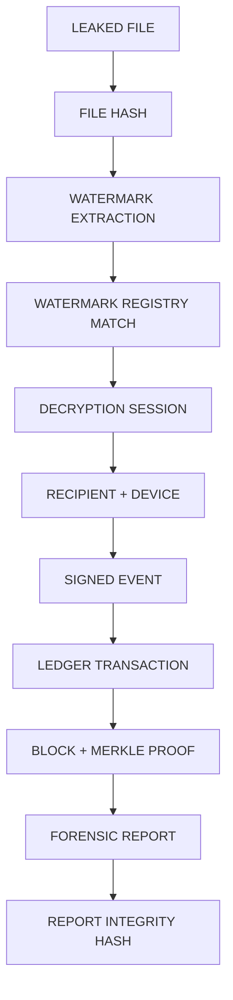

# Forensic process

How a leaked copy becomes a cryptographically verifiable finding — and where the process honestly
stops.

---

## 1. Chain of custody

Before anything is analysed:

| Field | Why it exists |
|---|---|
| `case_id` | An investigation is a container that can hold several artefacts |
| `evidence_id` | Each artefact is a discrete, separately hashed object |
| `collected_by` | Who took custody |
| `collected_at` | When |
| `content_sha256` | What the artefact was, at the moment of collection |
| `size_bytes` | Secondary integrity signal |
| `analysed_by`, `analysed_at` | Who analysed it, and when |
| `analysis_tool` | Which engine version produced the result |
| `limitations` | What the analysis could not establish |

The stored copy is **never modified by analysis**. The recorded hash keeps matching what was submitted,
which is what makes the finding defensible later.

Custody columns are protected by storage-level immutability triggers, so a direct database edit to them
is refused.

---

## 2. The eleven-link chain



Every link is verified independently. The first failure is reported **by name**, and the outcome
reflects it. There is no path where a partial result is presented as a complete one.

---

## 3. Step by step

### 3.1 Preserve

The artefact is written into the case directory with its SHA-256 and size recorded. Nothing else
happens yet, so the object under examination is fixed before any interpretation.

### 3.2 Extract the watermark — blindly

```
rasterise at fixed DPI
canonicalise across candidate scale factors
rebuild keyed carriers from the registry's document identity
correlate per payload bit
estimate noise within each bit's carrier set
soft decide, verify CRC
```

The original document is **not** an input. This is essential: a leaked copy's hash will never match the
original, because the watermarking step changed it. Keying the carriers to document identity rather
than to the file is what allows recovery from a copy that was edited.

### 3.3 Match against the registry

Extraction runs across every candidate document version that has issued watermarks. Each recovered tag
is compared to that version's registered tags by Hamming distance.

- Exact match with signal above threshold → `FOUND`
- Near miss above the weak threshold → `WEAK MATCH`
- Payload valid but no registered match → `CORRUPTED`
- No usable signal → `NOT FOUND`

### 3.4 Verify the session and recipient

The matched tag resolves to a session record, which resolves to a recipient identity, a device and a
document version. Absence of any of these ends the chain with `INSUFFICIENT EVIDENCE`.

### 3.5 Verify the recipient signature

The stored event payload is reconstructed and verified against the recipient's registered ML-DSA public
key. This is the link that makes attribution non-repudiable: the record could only have been produced
by the holder of the recipient's private key.

A failure here yields `SIGNATURE INVALID` and the chain stops. No other link is reported as if it
mattered.

### 3.6 Verify the ledger transaction and Merkle proof

The transaction is located in the ledger, and its inclusion is proved against the block's Merkle root.
The proof is recomputed from scratch — the node's word that the transaction exists is not accepted.

A failure yields `LEDGER PROOF INVALID`.

### 3.7 Verify document version integrity

The submitted copy is compared page-image-wise against the stored pre-encryption render.

| Condition | Result |
|---|---|
| PSNR ≥ 33 dB | Content consistent with the distributed version |
| PSNR < 33 dB | `DOCUMENT MODIFIED` |

The floor is chosen from measurement: a watermarked but otherwise untouched copy sits near 41 dB, so an
edit falls well clear of it.

---

## 4. Outcomes

| Outcome | Meaning |
|---|---|
| `VERIFIED ASSOCIATION` | Every link verified. A cryptographically verified link exists between this copy and an authorised decryption session. |
| `PARTIALLY VERIFIED` | Some links verified, at least one failed. The failing link is named. |
| `DOCUMENT MODIFIED` | The watermark resolved to a known session, but the content was altered after distribution. |
| `WATERMARK NOT RECOVERED` | No usable mark. Treated as an unattributed copy. |
| `NO MATCH FOUND` | A payload was recovered but matches no registered session. |
| `SIGNATURE INVALID` | The event does not verify against the recipient's key. Not attributable. |
| `LEDGER PROOF INVALID` | Not anchored in tamper-evident history. |
| `INSUFFICIENT EVIDENCE` | The file could not be analysed far enough to conclude. |

**`NOT FOUND` is a success of the honesty design.** A system that always returns a match will accuse
someone eventually.

---

## 5. The report

```json
{
  "report_type": "SENTINEL FORENSIC EVIDENCE REPORT",
  "chain_of_custody": { "collected_by": "...", "file_sha256": "...", "analysis_tool": "..." },
  "watermark": { "verdict": "FOUND", "confidence": 0.99, "derivation": "HMAC-SHA256 over ..." },
  "association": { "recipient_id": "...", "session_id": "...", "device_id": "..." },
  "document": { "document_id": "...", "version_number": 1, "recorded_content_sha256": "..." },
  "signed_event": { "event_hash": "...", "signature_verified": true },
  "ledger": { "block_id": "...", "merkle_proof": [], "merkle_proof_verified": true },
  "final_result": { "status": "VERIFIED ASSOCIATION" },
  "limitations": [ "..." ],
  "attestation": "...",
  "report_sha256": "..."
}
```

The report is hashed over its own canonical form excluding the hash field. Recomputing that hash after
any edit returns `EVIDENCE REPORT INTEGRITY: FAILED`. There is a test that alters a generated report
and asserts the failure, so the check cannot quietly stop working.

Every report carries an explicit limitations block and an attestation stating what it does not prove.

---

## 6. Investigator workflow

1. Open an investigation with a title and, if known, the suspected document.
2. Submit the artefact.
3. Read the chain top to bottom. Any red hop is the finding.
4. Read the limitations block before briefing anyone.
5. Generate and download the hashed report.
6. Record the interpretation as a case note.
7. Close the case with a conclusion. Cases are closed, never deleted.

**Confirm attribution with the recipient's unit before acting.** A cryptographically verified
association is strong evidence about a session. It is not a finding about a person.

---

## 7. What this process cannot do

1. **Prove who physically leaked the material.** It links a copy to a decryption session. A session is
   a cryptographic event, not a human act.
2. **Survive every capture method.** Angled photography, heavy cropping and print/scan are expected to
   defeat the mark, and the process reports that rather than guessing.
3. **Attribute a collusion.** Two recipients who difference their copies can estimate the mark.
4. **Prove the copy is complete.** Integrity checking detects modification; it cannot prove nothing was
   removed before the artefact reached the system.
5. **Function without the key vault's watermark root.** Without it, extraction cannot run. That secret
   is the system's central dependency and a production concern.
6. **Satisfy a legal standard.** Chain of custody here is technically sound and procedurally simple. A
   real proceeding requires jurisdictional compliance, independent verification and expert testimony.
