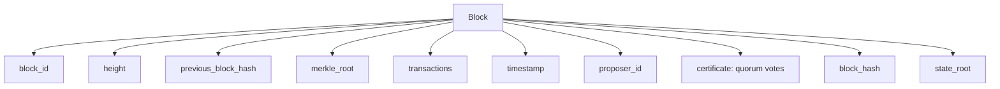
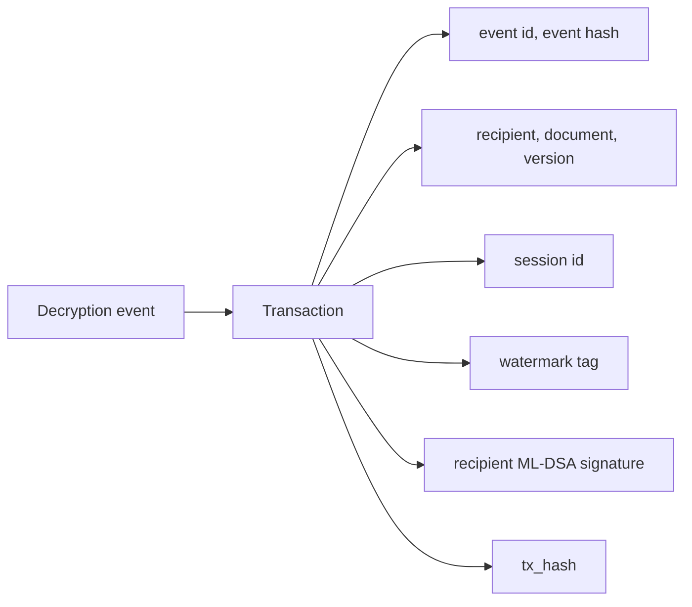
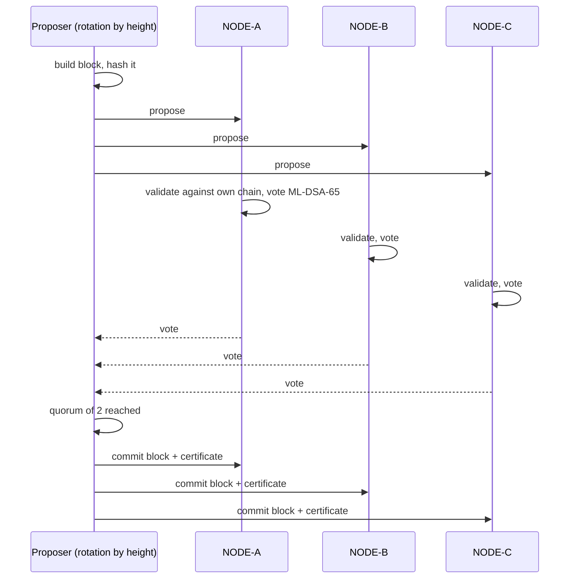
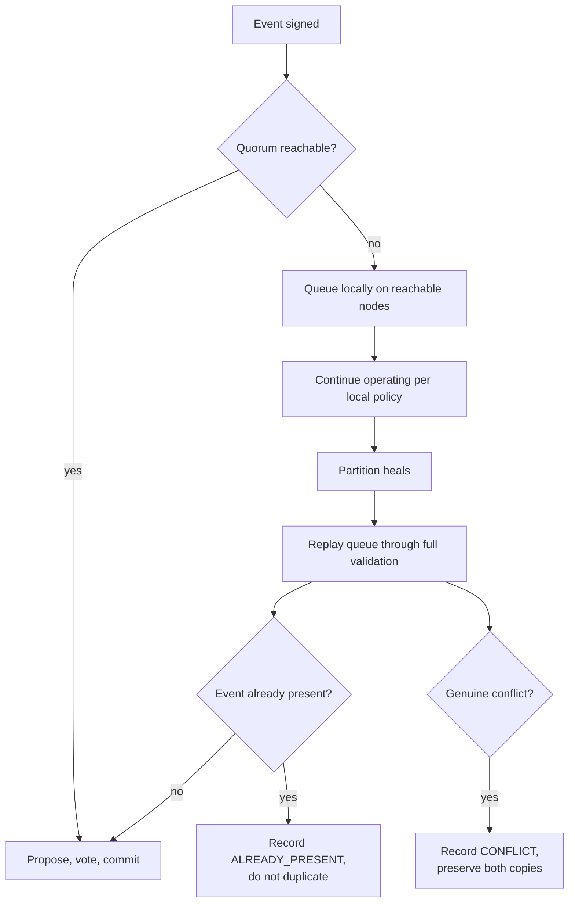

# Offline permissioned ledger

## What this is

A local, append-only, tamper-evident record shared across three independent replicas, designed so
that **altering history on one node is detectable without trusting that node**.

It is not a public blockchain. There is no proof-of-work, no token, no external network and no
consensus mechanism borrowed from cryptocurrency. It is closer to a permissioned BFT round between a
small, known set of nodes.

---

## 1. Block structure



`block_hash` is SHA-256 over the canonical body: block id, height, previous hash, Merkle root,
timestamp, proposer, and the transaction bodies.

**`state_root` is deliberately excluded from the hashed body.** It is a running commitment derived
*from* the block hash, so including it would make the hash self-referential and the stored value
unrecomputable. That bug existed during development and is the reason the exclusion is commented.

### The genesis anchor

All three nodes store a byte-identical genesis block: fixed proposer `SENTINEL-CONSORTIUM` and a fixed
timestamp, with an empty transaction set. Each node signs it locally, and that signature is stored for
inspection but is not part of the hashed body.

If each node minted its own genesis, the state roots could never agree from height zero and
cross-node agreement would be meaningless.

---

## 2. Transactions

A transaction is a signed decryption event:



`tx_hash` is SHA-256 over the canonical transaction body. The recipient signature travels with the
transaction, so a ledger record asserts something a specific recipient authorised, and that assertion
is independently checkable without the operational database.

---

## 3. Merkle proofs

RFC 6962 construction: leaves are `SHA256(0x00 || canonical_tx)` and internal nodes are
`SHA256(0x01 || left || right)`.

Odd levels are padded by duplicating the last node. Proof construction must look siblings up in the
*padded* level — with five transactions, level zero has six slots. Getting that wrong was a real bug,
and `tests/test_ledger_forensics_ops.py::TestMerkleTree` now parametrises over 1 through 17
transactions so the padding paths cannot regress.

A proof lets an investigator confirm a specific transaction was committed using only the block's Merkle
root and the proof — **not** the word of the node that stored it.

---

## 4. Consensus



A node independently checks that the proposal extends **its own** chain — correct previous hash,
correct next height, and a Merkle root matching the transactions. A malicious proposer therefore
cannot fork a node silently.

The quorum certificate is a list of post-quantum signatures over `(block_id, height, block_hash,
node_id)`. Every vote is verifiable on its own, so a certificate can be audited without replaying the
round.

**Documented assumption:** deterministic rotation behaves correctly for a fixed node count. It is not
a formally reviewed BFT protocol, and `docs/PRODUCTION_GAPS.md` lists the safety argument as required
production work.

---

## 5. Verification

Verification never trusts what a node says about itself. Per node, per block, it recomputes:

| Check | What it catches |
|---|---|
| Chain linkage | A block that does not extend the previous one |
| Merkle root | A transaction removed or altered inside a block |
| Block hash | An edited block body |
| State root | A node that has rewritten its own past |
| Block signature | A block not actually proposed by the node it names |
| Quorum vote signatures | A fabricated certificate |

Then it compares running state roots across nodes. A node that recomputed only its own block hash still
fails, because the Merkle root and the signatures are recomputed too.

**Outcome:** `LEDGER INTEGRITY: VERIFIED` or `LEDGER INTEGRITY: TAMPER DETECTED`, with the failing
height and check named per node.

---

## 6. Tamper evidence

```mermaid
graph TB
  A[Attacker writes to one node's database] --> B{Storage guards<br/>still present?}
  B -- yes --> C[Write refused<br/>"these columns are immutable"]
  B -- no --> D[Guard dropped, write succeeds]
  D --> E[Verification on that node<br/>BLOCK_HASH + STATE_ROOT fail]
  D --> F[Cross-node comparison<br/>CONSISTENCY FAILURE]
  E --> G[Security event + incident]
  F --> G
```

The attack laboratory demonstrates both halves. It attempts the write first — which the storage guard
refuses — then removes the guard as an attacker with database access would, and shows that
replication-based detection catches the change anyway.

Conflicting records are **preserved on every node**. Nothing is overwritten, because the conflicting
state is itself evidence.

### Storage guards

SQLite triggers refuse updates to security-bearing columns and refuse deletes entirely. The guards are
scoped to specific columns rather than whole rows, so an evidence row can still gain its analysis
result once while its custody fields stay immutable:

```sql
CREATE TRIGGER immutable_update_ledger_blocks
BEFORE UPDATE OF block_id, height, previous_block_hash, merkle_root,
                      block_hash, timestamp, proposer_id, state_root
ON ledger_blocks
BEGIN SELECT RAISE(ABORT, 'ledger_blocks: these columns are immutable'); END;
```

Guarded tables: `ledger_blocks`, `ledger_transactions`, `audit_records`, `decryption_events`,
`evidence_items`, `watermarks`, `security_events`.

---

## 7. Offline operation



Nothing is ever discarded. Below quorum, events queue locally and the UI shows
`OFFLINE OPERATIONS ACTIVE` with a pending count. On reconnection the queue replays through the same
proposer, vote and validation path — not a privileged fast path.

The attack laboratory's `network_partition` scenario proves the property: it partitions the network,
records events, heals, synchronises, and asserts that the pending count reaches zero.

---

## 8. Node health

| Field | Meaning |
|---|---|
| `status` | ONLINE / OFFLINE |
| `block_height` | Highest committed height |
| `latest_block_hash` | Head hash |
| `previous_block_hash` | Chain link at the head |
| `latest_merkle_root` | Root covering the head block's transactions |
| `state_root` | Running commitment to full history |
| `pending_sync_count` | Events queued locally |
| `integrity_status` | Last verification verdict |
| `divergent_from_peers` | Disagrees with the majority |

---

## 9. What this does not provide

1. **No public verifiability.** Only parties holding the node keys can verify. That is appropriate here
   and would be a limitation for public audit.
2. **No protection against a majority-compromised node set.** A quorum of 2 of 3 tolerates one
   compromised node, not two.
3. **No independence of the replicas.** Each node has its own database file, but they share a host.
   Real independence means separate hosts or containers with separate trust.
4. **No long-term key archival.** Verifying a signature from ten years ago requires that node's public
   key to remain available. Production needs key archival and algorithm agility.
5. **No formal consensus proof.** See section 4.
6. **Not a blockchain.** It provides tamper evidence and replicated audit integrity. It does not make
   anything "unhackable", and it makes no such claim.
