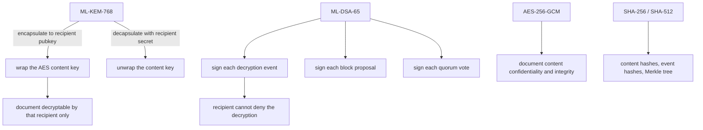

# Post-quantum cryptography

## What is used

| Purpose | Algorithm | Standard | Implementation |
|---|---|---|---|
| Key establishment | ML-KEM-768 | FIPS 203 | `pqcrypto` 1.0.0, compiled PQClean code |
| Signatures | ML-DSA-65 | FIPS 204 | `pqcrypto` 1.0.0, compiled PQClean code |
| Document content | AES-256-GCM | FIPS 197 | `cryptography` 50.0.2 |
| Key derivation | HKDF-SHA256 | NIST SP 800-108 | `cryptography` |
| Key protection at rest | scrypt + AES-256-GCM | RFC 7914 | `cryptography` |
| Password hashing | PBKDF2-HMAC-SHA256, 240k iterations | — | Python standard library |
| Hashing | SHA-256 / SHA-512 | FIPS 180-4 | Python standard library |

Verified locally:

```
signing        : Mldsa65      (ML-DSA-65)
key agreement  : MlKem768     (ML-KEM-768)
library        : pqcrypto 1.0.0 (PQClean-derived, liboqs API)
module         : pqcrypto.sign.ml_dsa_65 / pqcrypto.kem.ml_kem_768
production_grade_backend: True
```

`production_grade_backend` means a real compiled implementation of the standard algorithm is in use.
It does **not** mean a validated module. See `docs/PRODUCTION_GAPS.md`.

---

## The provider interface

`backend/app/crypto/pqc.py` is the only place that talks to the algorithm library.

```python
generate_signing_keypair() -> Keypair
sign(secret_key, message, context=...) -> Signature
verify(public_key, message, signature, context=...) -> bool

generate_kem_keypair() -> Keypair
encapsulate(kem_public_key) -> Encapsulation
decapsulate(kem_secret_key, ciphertext) -> bytes
```

No algorithm is implemented in this repository. If the library is unavailable, the provider reports
`PQC_BACKEND_UNAVAILABLE` and says so — it does not silently substitute a classical algorithm.

---

## Why AES still encrypts the document

FIPS 203 standardises ML-KEM for key establishment. FIPS 204 standardises ML-DSA for signatures.
Neither addresses bulk data, and NIST guidance continues to recommend symmetric authenticated
encryption for data at rest.

So the design is:

```
content            AES-256-GCM          correct primitive for bulk data
content key wrap   ML-KEM-768 + HKDF    post-quantum key establishment
session signing    ML-DSA-65            post-quantum non-repudiation
```

Claiming AES is post-quantum would be **incorrect**, and the documentation says so in three places
rather than hedging.

---

## Domain separation

Every signature is made over a context string that ML-DSA authenticates:

| Context | Used for |
|---|---|
| `FORGE/decryption-event/v1` | Decryption events |
| `FORGE/ledger-block/v1` | Block proposals |
| `FORGE/ledger-vote/v1` | Quorum votes |
| `FORGE/session-attestation/v1` | Session attestations |

Without this, a signature minted for a decryption event could be replayed as a ledger vote or a block
signature. `tests/test_cryptography.py::test_domain_separation_prevents_cross_use` asserts that
verification fails across contexts.

---

## Where each primitive appears



**Every decryption event is signed by the recipient's key, not the server's.** The server holds its own
identity (`SENTINEL-SERVER`) used for its own assertions and nothing else. This is what makes
attribution meaningful, and the attack laboratory demonstrates that a server-key forgery is rejected.

---

## Migration notes

**Q: Why ML-KEM-768 and not 512?**
Security margin over performance. The prototype's operation counts are far below where 768 would
matter, and the larger parameter set is the more defensible default for long-lived material.

**Q: Why ML-DSA-65 and not 44?**
65 is the middle of the three standard parameter sets and gives comfortable margin for non-repudiation
records that may need to remain verifiable for years. Signature cost is roughly 6 ms, verified in under
a millisecond — irrelevant at this volume.

**Q: What is the plan for algorithm agility?**
Key metadata stores the algorithm name and version, and verification takes the key's algorithm from
that record rather than a global setting. Migration means issuing keys under a new algorithm and
retaining verification support for the old one. Watermarks carry a `watermark_version` and the policy
carries a `policy_version`, so derivation can be versioned independently.

**Q: Are these implementations constant-time?**
The compiled PQClean code aims to be, but this prototype has not been assessed for side-channel
resistance and makes no claim. That assessment belongs with the cryptographic validation work listed in
`docs/PRODUCTION_GAPS.md`.

**Q: Can these signatures be forged by the service?**
No. The service holds no recipient private key in a form it can use to sign a decryption event. The
attack laboratory's `signature_forgery` scenario signs a fabricated event with the service key and
shows verification failing against the recipient's registered public key.
